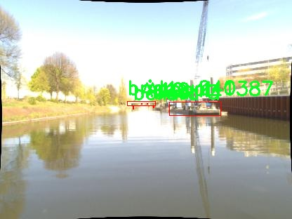
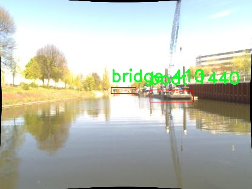

# 水上基础设施检测系统源码分享
 # [一条龙教学YOLOV8标注好的数据集一键训练_70+全套改进创新点发刊_Web前端展示]

### 1.研究背景与意义

项目参考[AAAI Association for the Advancement of Artificial Intelligence](https://gitee.com/qunmasj/projects)

项目来源[AACV Association for the Advancement of Computer Vision](https://kdocs.cn/l/cszuIiCKVNis)

研究背景与意义

随着全球水上交通的快速发展，水上基础设施的安全性和有效性愈发受到重视。水上基础设施包括船只、浮标、桥梁、系缆柱等多种重要构件，这些设施在航运、渔业、旅游等多个领域中发挥着至关重要的作用。然而，传统的水上基础设施检测方法往往依赖人工巡检，效率低下且容易受到人为因素的影响，难以满足现代化管理的需求。因此，基于计算机视觉和深度学习技术的自动化检测系统应运而生，成为提升水上基础设施管理效率的重要手段。

YOLO（You Only Look Once）系列模型因其高效的实时目标检测能力而受到广泛关注。YOLOv8作为该系列的最新版本，具备更高的检测精度和更快的处理速度，能够在复杂的水上环境中有效识别和定位多种基础设施。通过对YOLOv8模型的改进，可以进一步提升其在水上基础设施检测中的应用效果，使其更好地适应水面反射、光照变化等复杂条件。

本研究基于改进YOLOv8模型，构建一个高效的水上基础设施检测系统，旨在实现对水上基础设施的自动化、智能化监测。为此，我们使用了BEWA_23082022数据集，该数据集包含568幅图像，涵盖12个类别的目标，包括船只、浮标、桥梁、系缆柱等。这些类别的多样性为模型的训练和测试提供了丰富的样本，有助于提高模型的泛化能力和适应性。

通过对该数据集的深入分析，我们发现不同类别的水上基础设施在形态、颜色、尺寸等方面存在显著差异，这为目标检测模型的训练提供了良好的基础。改进YOLOv8模型的关键在于如何有效地利用这些数据特征，以提高模型在不同环境下的检测准确率。此外，数据集中不同类别目标的标注信息为模型的监督学习提供了必要的支持，使得模型能够在训练过程中不断优化自身的检测能力。

本研究的意义不仅在于提升水上基础设施的检测效率，还在于为水上交通安全管理提供科学依据。通过自动化检测系统，管理者可以实时获取水上基础设施的状态信息，及时发现潜在的安全隐患，从而采取相应的维护措施，降低事故发生的风险。此外，基于深度学习的检测系统还可以为未来的智能水上交通管理系统奠定基础，推动水上交通的智能化发展。

综上所述，基于改进YOLOv8的水上基础设施检测系统的研究，不仅具有重要的理论价值，也具有广泛的应用前景。通过这一研究，我们期望能够为水上基础设施的安全管理提供新的思路和方法，推动相关领域的技术进步与发展。

### 2.图片演示


##### 注意：由于此博客编辑较早，上面“2.图片演示”和“3.视频演示”展示的系统图片或者视频可能为老版本，新版本在老版本的基础上升级如下：（实际效果以升级的新版本为准）

  （1）适配了YOLOV8的“目标检测”模型和“实例分割”模型，通过加载相应的权重（.pt）文件即可自适应加载模型。

  （2）支持“图片识别”、“视频识别”、“摄像头实时识别”三种识别模式。

  （3）支持“图片识别”、“视频识别”、“摄像头实时识别”三种识别结果保存导出，解决手动导出（容易卡顿出现爆内存）存在的问题，识别完自动保存结果并导出到tempDir中。

  （4）支持Web前端系统中的标题、背景图等自定义修改，后面提供修改教程。

  另外本项目提供训练的数据集和训练教程,暂不提供权重文件（best.pt）,需要您按照教程进行训练后实现图片演示和Web前端界面演示的效果。

### 3.视频演示

[3.1 视频演示](https://www.bilibili.com/video/BV1GW1yYNE8e/)

### 4.数据集信息展示

##### 4.1 本项目数据集详细数据（类别数＆类别名）

nc: 6
names: ['A.10', 'A.5', 'A_1', 'boat', 'bollard', 'bridge']


##### 4.2 本项目数据集信息介绍

数据集信息展示

在现代计算机视觉领域，数据集的质量和多样性直接影响到模型的性能和泛化能力。为此，本研究采用了名为“BEWA_23082022”的数据集，以支持改进YOLOv8的水上基础设施检测系统。该数据集专注于水上环境中的关键基础设施，涵盖了六个主要类别，分别为：A.10、A.5、A_1、船只（boat）、系缆柱（bollard）和桥梁（bridge）。这些类别的选择反映了水上基础设施的多样性及其在实际应用中的重要性。

“BEWA_23082022”数据集的构建经过精心设计，旨在提供丰富的图像样本，以便训练和验证检测模型。数据集中包含的每个类别都代表了水上环境中常见的元素。例如，船只作为水上交通的主要工具，其种类繁多，形态各异，因此在数据集中占据了重要位置。系缆柱则是船只停靠时不可或缺的设施，能够帮助确保船只的安全停靠。桥梁则是连接水域两岸的重要基础设施，其检测对于水上交通的安全和畅通至关重要。

在数据集的构建过程中，研究团队通过多种途径收集了大量高质量的图像，包括实地拍摄、无人机航拍以及现有数据库的整合。这些图像不仅涵盖了不同的天气条件和光照变化，还考虑了不同的拍摄角度和距离，以确保模型能够在各种实际应用场景中表现出色。此外，数据集中的每个图像都经过精确的标注，确保每个类别的目标都被准确识别和定位。这种高质量的标注对于训练深度学习模型至关重要，因为它直接影响到模型的学习效果和最终的检测精度。

为了进一步提升模型的鲁棒性和适应性，数据集还包含了多样化的场景设置，例如城市水域、乡村河流以及开放海域等。这种多样性不仅能够帮助模型学习到不同环境下的特征，还能提高其在真实世界应用中的实用性。通过在不同的场景中进行训练，YOLOv8模型能够更好地应对各种复杂情况，从而实现更高的检测准确率。

在数据集的使用过程中，研究者们将采用先进的数据增强技术，以进一步扩展训练样本的多样性。这些技术包括图像旋转、缩放、翻转以及颜色调整等，旨在模拟不同的视觉条件和场景变化，从而提升模型的泛化能力。通过这种方式，研究团队希望能够构建一个更加智能和灵活的水上基础设施检测系统，能够在实际应用中快速、准确地识别和定位目标。

总之，“BEWA_23082022”数据集为改进YOLOv8的水上基础设施检测系统提供了坚实的基础。其丰富的类别、多样的场景和高质量的标注，将为模型的训练和优化提供强有力的支持，推动水上基础设施检测技术的发展。随着研究的深入，期待该数据集能够为水上安全和交通管理领域带来积极的影响。







### 5.全套项目环境部署视频教程（零基础手把手教学）

[5.1 环境部署教程链接（零基础手把手教学）](https://www.ixigua.com/7404473917358506534?logTag=c807d0cbc21c0ef59de5)


[5.2 安装Python虚拟环境创建和依赖库安装视频教程链接（零基础手把手教学）](https://www.ixigua.com/7404474678003106304?logTag=1f1041108cd1f708b01a)

### 6.手把手YOLOV8训练视频教程（零基础小白有手就能学会）

[6.1 手把手YOLOV8训练视频教程（零基础小白有手就能学会）](https://www.ixigua.com/7404477157818401292?logTag=d31a2dfd1983c9668658)


按照上面的训练视频教程链接加载项目提供的数据集，运行train.py即可开始训练



     Epoch   gpu_mem       box       obj       cls    labels  img_size
     1/200     20.8G   0.01576   0.01955  0.007536        22      1280: 100%|██████████| 849/849 [14:42<00:00,  1.04s/it]
               Class     Images     Labels          P          R     mAP@.5 mAP@.5:.95: 100%|██████████| 213/213 [01:14<00:00,  2.87it/s]
                 all       3395      17314      0.994      0.957      0.0957      0.0843

     Epoch   gpu_mem       box       obj       cls    labels  img_size
     2/200     20.8G   0.01578   0.01923  0.007006        22      1280: 100%|██████████| 849/849 [14:44<00:00,  1.04s/it]
               Class     Images     Labels          P          R     mAP@.5 mAP@.5:.95: 100%|██████████| 213/213 [01:12<00:00,  2.95it/s]
                 all       3395      17314      0.996      0.956      0.0957      0.0845

     Epoch   gpu_mem       box       obj       cls    labels  img_size
     3/200     20.8G   0.01561    0.0191  0.006895        27      1280: 100%|██████████| 849/849 [10:56<00:00,  1.29it/s]
               Class     Images     Labels          P          R     mAP@.5 mAP@.5:.95: 100%|███████   | 187/213 [00:52<00:00,  4.04it/s]
                 all       3395      17314      0.996      0.957      0.0957      0.0845


### 7.70+种全套YOLOV8创新点代码加载调参视频教程（一键加载写好的改进模型的配置文件）

[7.1 70+种全套YOLOV8创新点代码加载调参视频教程（一键加载写好的改进模型的配置文件）](https://www.ixigua.com/7404478314661806627?logTag=29066f8288e3f4eea3a4)

### 8.70+种全套YOLOV8创新点原理讲解（非科班也可以轻松写刊发刊，V10版本正在科研待更新）

#### 由于篇幅限制，每个创新点的具体原理讲解就不一一展开，具体见下列网址中的创新点对应子项目的技术原理博客网址【Blog】：


[8.1 70+种全套YOLOV8创新点原理讲解链接](https://gitee.com/qunmasj/good)

#### 部分改进原理讲解(完整的改进原理见上图和技术博客链接)

### Gold-YOLO


#### Preliminaries
YOLO系列的中间层结构采用了传统的FPN结构，其中包含多个分支用于多尺度特征融合。然而，它只充分融合来自相邻级别的特征，对于其他层次的信息只能间接地进行“递归”获取。

传统的FPN结构在信息传输过程中存在丢失大量信息的问题。这是因为层之间的信息交互仅限于中间层选择的信息，未被选择的信息在传输过程中被丢弃。这种情况导致某个Level的信息只能充分辅助相邻层，而对其他全局层的帮助较弱。因此，整体上信息融合的有效性可能受到限制。
为了避免在传输过程中丢失信息，本文采用了一种新颖的“聚集和分发”机制（GD），放弃了原始的递归方法。该机制使用一个统一的模块来收集和融合所有Level的信息，并将其分发到不同的Level。通过这种方式，作者不仅避免了传统FPN结构固有的信息丢失问题，还增强了中间层的部分信息融合能力，而且并没有显著增加延迟。


#### 低阶聚合和分发分支 Low-stage gather-and-distribute branch
从主干网络中选择输出的B2、B3、B4、B5特征进行融合，以获取保留小目标信息的高分辨率特征。


#### 高阶聚合和分发分支 High-stage gather-and-distribute branch
高级全局特征对齐模块（High-GD）将由低级全局特征对齐模块（Low-GD）生成的特征{P3, P4, P5}进行融合。


Transformer融合模块由多个堆叠的transformer组成，transformer块的数量为L。每个transformer块包括一个多头注意力块、一个前馈网络（FFN）和残差连接。采用与LeViT相同的设置来配置多头注意力块，使用16个通道作为键K和查询Q的头维度，32个通道作为值V的头维度。为了加速推理过程，将层归一化操作替换为批归一化，并将所有的GELU激活函数替换为ReLU。为了增强变换器块的局部连接，在两个1x1卷积层之间添加了一个深度卷积层。同时，将FFN的扩展因子设置为2，以在速度和计算成本之间取得平衡。


信息注入模块(Information injection module)： 高级全局特征对齐模块（High-GD）中的信息注入模块与低级全局特征对齐模块（Low-GD）中的相同。在高级阶段，局部特征（Flocal）等于Pi，因此公式如下所示：


#### 增强的跨层信息流动 Enhanced cross-layer information flow
为了进一步提升性能，从YOLOv6 中的PAFPN模块中得到启发，引入了Inject-LAF模块。该模块是注入模块的增强版，包括了一个轻量级相邻层融合（LAF）模块，该模块被添加到注入模块的输入位置。为了在速度和准确性之间取得平衡，设计了两个LAF模型：LAF低级模型和LAF高级模型，分别用于低级注入（合并相邻两层的特征）和高级注入（合并相邻一层的特征）。它们的结构如图5(b)所示。为了确保来自不同层级的特征图与目标大小对齐，在实现中的两个LAF模型仅使用了三个操作符：双线性插值（上采样过小的特征）、平均池化（下采样过大的特征）和1x1卷积（调整与目标通道不同的特征）。模型中的LAF模块与信息注入模块的结合有效地平衡了准确性和速度之间的关系。通过使用简化的操作，能够增加不同层级之间的信息流路径数量，从而提高性能而不显著增加延迟。


### 9.系统功能展示（检测对象为举例，实际内容以本项目数据集为准）

图9.1.系统支持检测结果表格显示

  图9.2.系统支持置信度和IOU阈值手动调节

  图9.3.系统支持自定义加载权重文件best.pt(需要你通过步骤5中训练获得)

  图9.4.系统支持摄像头实时识别

  图9.5.系统支持图片识别

  图9.6.系统支持视频识别

  图9.7.系统支持识别结果文件自动保存

  图9.8.系统支持Excel导出检测结果数据


### 10.原始YOLOV8算法原理

原始YOLOv8算法原理

YOLOv8算法是由Glenn-Jocher提出的最新目标检测模型，承载着YOLO系列算法的进化历程，延续了YOLOv3和YOLOv5的核心思想，同时在多个方面进行了创新和改进。其设计理念旨在提升目标检测的速度和准确性，尤其是在复杂场景下的表现。YOLOv8的核心结构可分为三个主要部分：Backbone、Neck和Head，这些部分协同工作，以实现高效的特征提取和目标检测。

在数据预处理方面，YOLOv8继承了YOLOv5的策略，采用了多种增强手段来提升模型的鲁棒性和泛化能力。这些增强手段包括马赛克增强、混合增强、空间扰动和颜色扰动。这些技术的应用不仅丰富了训练数据的多样性，还有效提高了模型在不同场景下的适应能力。通过这种数据增强策略，YOLOv8能够更好地捕捉到目标物体的特征，减少过拟合现象，从而提升模型的整体性能。

YOLOv8的骨干网络结构是其重要的组成部分之一。相较于YOLOv5，YOLOv8在主干网络中引入了C2f模块，替代了原有的C3模块。C2f模块的设计允许更多的分支结构，这种结构在梯度回传时提供了更丰富的信息流，增强了特征提取的能力。具体而言，C2f模块通过将输入特征图分为多个分支，进行并行处理，从而提高了特征图的维度和复杂性。这种设计不仅提升了模型的学习能力，还有效地加速了训练过程。

在特征融合方面，YOLOv8继续采用FPN（特征金字塔网络）和PAN（路径聚合网络）的结构，以实现多尺度信息的充分融合。通过这种结构，YOLOv8能够在不同的特征层之间进行有效的信息传递，从而提高了对小目标和大目标的检测能力。与YOLOv5相比，YOLOv8在FPN-PAN结构中同样将C3模块替换为C2f模块，这一变化进一步增强了特征融合的效果，使得模型在处理复杂场景时更加灵活和高效。

YOLOv8在检测头的设计上也进行了重要的改进。传统的YOLO系列算法采用耦合检测头，即通过一层卷积同时完成分类和定位任务。而YOLOv8则引入了解耦头的结构，采用两条并行的分支来分别提取类别特征和位置特征。这样的设计使得分类和定位任务可以独立优化，从而提高了检测的准确性和效率。解耦头的使用使得YOLOv8在处理复杂场景时能够更好地应对目标重叠和背景干扰的问题。

在标签分配策略方面，YOLOv8采用了与YOLOv6相同的TOOD策略，旨在解决正负样本匹配的多尺度分配问题。不同于YOLOv5依赖于数据集的候选框聚类，YOLOv8的设计使得标签分配更加灵活和动态。通过仅使用目标框和目标分数，YOLOv8能够有效地计算损失函数，主要包括类别损失和位置损失。在分类损失方面，YOLOv8引入了Varifocal Loss（VFL），通过不对称参数对正负样本进行加权，强调高质量正样本对模型训练的重要性。对于位置损失，YOLOv8结合了CIoU Loss和DFL Loss，以进一步提升目标定位的精度。

YOLOv8的整体网络结构展现了其在设计上的创新与实用性。Backbone部分通过CSPDarknet结构实现特征提取，结合C2f模块和快速空间金字塔池化（SPPF）模块，提升了特征提取的效率和效果。Neck部分则通过多尺度特征融合技术，增强了模型对不同尺度目标的捕捉能力。最后，Head部分通过解耦检测头的设计，优化了目标检测和分类的性能。

总的来说，YOLOv8算法在保持YOLO系列传统优势的基础上，通过一系列创新设计，显著提升了目标检测的速度和准确性。其在数据预处理、骨干网络、特征融合、检测头和标签分配策略等多个方面的改进，使得YOLOv8在复杂场景下的表现更加出色，成为目标检测领域的重要进展。随着YOLOv8的推广和应用，未来的目标检测任务将更加高效和准确，为各类计算机视觉应用提供了强有力的支持。


### 11.项目核心源码讲解（再也不用担心看不懂代码逻辑）

#### 11.1 70+种YOLOv8算法改进源码大全和调试加载训练教程（非必要）\ultralytics\models\sam\build.py

以下是对代码的核心部分进行提炼和详细注释的结果：

```python
# 导入必要的库
from functools import partial
import torch

# 导入所需的模块
from ultralytics.utils.downloads import attempt_download_asset
from .modules.decoders import MaskDecoder
from .modules.encoders import ImageEncoderViT, PromptEncoder
from .modules.sam import Sam
from .modules.tiny_encoder import TinyViT
from .modules.transformer import TwoWayTransformer

def _build_sam(encoder_embed_dim,
               encoder_depth,
               encoder_num_heads,
               encoder_global_attn_indexes,
               checkpoint=None,
               mobile_sam=False):
    """构建指定的SAM模型架构。
    
    参数:
    encoder_embed_dim: 编码器的嵌入维度
    encoder_depth: 编码器的深度
    encoder_num_heads: 编码器的头数
    encoder_global_attn_indexes: 全局注意力索引
    checkpoint: 预训练模型的检查点路径
    mobile_sam: 是否构建移动版本的SAM模型
    """
    prompt_embed_dim = 256  # 提示嵌入维度
    image_size = 1024  # 输入图像的大小
    vit_patch_size = 16  # ViT的补丁大小
    image_embedding_size = image_size // vit_patch_size  # 图像嵌入大小

    # 根据是否为移动版本选择不同的图像编码器
    image_encoder = (TinyViT(
        img_size=1024,
        in_chans=3,
        num_classes=1000,
        embed_dims=encoder_embed_dim,
        depths=encoder_depth,
        num_heads=encoder_num_heads,
        window_sizes=[7, 7, 14, 7],
        mlp_ratio=4.0,
        drop_rate=0.0,
        drop_path_rate=0.0,
        use_checkpoint=False,
        mbconv_expand_ratio=4.0,
        local_conv_size=3,
    ) if mobile_sam else ImageEncoderViT(
        depth=encoder_depth,
        embed_dim=encoder_embed_dim,
        img_size=image_size,
        mlp_ratio=4,
        norm_layer=partial(torch.nn.LayerNorm, eps=1e-6),
        num_heads=encoder_num_heads,
        patch_size=vit_patch_size,
        qkv_bias=True,
        use_rel_pos=True,
        global_attn_indexes=encoder_global_attn_indexes,
        window_size=14,
        out_chans=prompt_embed_dim,
    ))

    # 创建SAM模型
    sam = Sam(
        image_encoder=image_encoder,
        prompt_encoder=PromptEncoder(
            embed_dim=prompt_embed_dim,
            image_embedding_size=(image_embedding_size, image_embedding_size),
            input_image_size=(image_size, image_size),
            mask_in_chans=16,
        ),
        mask_decoder=MaskDecoder(
            num_multimask_outputs=3,
            transformer=TwoWayTransformer(
                depth=2,
                embedding_dim=prompt_embed_dim,
                mlp_dim=2048,
                num_heads=8,
            ),
            transformer_dim=prompt_embed_dim,
            iou_head_depth=3,
            iou_head_hidden_dim=256,
        ),
        pixel_mean=[123.675, 116.28, 103.53],  # 图像像素均值
        pixel_std=[58.395, 57.12, 57.375],  # 图像像素标准差
    )

    # 如果提供了检查点，则加载预训练权重
    if checkpoint is not None:
        checkpoint = attempt_download_asset(checkpoint)  # 尝试下载检查点
        with open(checkpoint, 'rb') as f:
            state_dict = torch.load(f)  # 加载模型状态字典
        sam.load_state_dict(state_dict)  # 加载状态字典到模型中

    sam.eval()  # 设置模型为评估模式
    return sam  # 返回构建的SAM模型

def build_sam(ckpt='sam_b.pt'):
    """根据指定的检查点构建SAM模型。
    
    参数:
    ckpt: 检查点文件名
    """
    model_builder = None
    ckpt = str(ckpt)  # 将检查点转换为字符串，以支持Path类型
    for k in sam_model_map.keys():
        if ckpt.endswith(k):  # 检查文件名是否匹配
            model_builder = sam_model_map.get(k)

    if not model_builder:
        raise FileNotFoundError(f'{ckpt} 不是支持的SAM模型。可用模型有: \n {sam_model_map.keys()}')

    return model_builder(ckpt)  # 返回构建的模型
```

### 代码核心部分说明：
1. **_build_sam函数**：该函数负责构建SAM模型的核心架构，包括选择合适的图像编码器（`TinyViT`或`ImageEncoderViT`），并设置提示编码器和掩码解码器。它还处理加载预训练模型的权重。

2. **build_sam函数**：该函数根据给定的检查点名称选择合适的模型构建器，并返回构建的SAM模型。如果提供的检查点不在支持的模型列表中，则抛出错误。

3. **模型参数**：模型的构建涉及多个参数，如嵌入维度、深度、头数等，这些参数决定了模型的复杂性和性能。

4. **评估模式**：模型在加载完权重后被设置为评估模式，以确保在推理时不会进行训练相关的操作（如dropout）。

这个文件是一个用于构建和加载Segment Anything Model（SAM）模型的Python脚本，主要依赖于PyTorch库。文件的开头包含版权信息和许可证声明，表明该代码遵循AGPL-3.0许可证。

文件中定义了多个函数，用于构建不同尺寸的SAM模型，包括高（h）、大（l）、小（b）和移动版（Mobile-SAM）。每个构建函数调用了一个私有函数`_build_sam`，该函数负责创建具体的模型架构。不同尺寸的模型在编码器的嵌入维度、深度、头数以及全局注意力索引等参数上有所不同，这些参数影响模型的复杂性和性能。

`_build_sam`函数内部首先定义了一些基本参数，例如提示嵌入维度、图像大小和补丁大小。接着根据是否是移动版模型，选择不同的图像编码器（TinyViT或ImageEncoderViT）。TinyViT是一个轻量级的视觉变换器，适合移动设备，而ImageEncoderViT则是标准的视觉变换器，适合更强大的计算资源。

在构建SAM模型时，还包括了提示编码器（PromptEncoder）和掩码解码器（MaskDecoder）。提示编码器用于处理输入的提示信息，而掩码解码器则负责生成多种掩码输出，结合了一个双向变换器（TwoWayTransformer）来增强模型的表现。

如果提供了检查点路径，脚本会尝试下载并加载模型的状态字典，以便恢复模型的训练状态。最后，模型会被设置为评估模式（eval），准备进行推理。

在文件的末尾，定义了一个字典`sams_model_map`，将模型文件名映射到相应的构建函数。`build_sam`函数根据传入的检查点名称选择合适的构建函数，构建指定的SAM模型。如果检查点名称不在支持的模型列表中，函数会抛出一个文件未找到的异常。

总的来说，这个文件提供了一个灵活的接口来构建和加载不同配置的SAM模型，适用于各种计算任务。

#### 11.2 70+种YOLOv8算法改进源码大全和调试加载训练教程（非必要）\ultralytics\nn\extra_modules\kernel_warehouse.py

以下是经过简化和注释的核心代码部分：

```python
import torch
import torch.nn as nn
import torch.nn.functional as F

class Attention(nn.Module):
    def __init__(self, in_planes, reduction, num_static_cell, num_local_mixture, norm_layer=nn.BatchNorm1d):
        super(Attention, self).__init__()
        # 隐藏层的通道数
        hidden_planes = max(int(in_planes * reduction), 16)
        self.kw_planes_per_mixture = num_static_cell + 1  # 每个混合的关键点数量
        self.num_local_mixture = num_local_mixture  # 本地混合数量
        self.kw_planes = self.kw_planes_per_mixture * num_local_mixture  # 总的关键点数量

        # 定义层
        self.avgpool = nn.AdaptiveAvgPool1d(1)  # 自适应平均池化
        self.fc1 = nn.Linear(in_planes, hidden_planes)  # 全连接层1
        self.norm1 = norm_layer(hidden_planes)  # 归一化层
        self.act1 = nn.ReLU(inplace=True)  # 激活函数

        # 初始化权重
        self._initialize_weights()

    def _initialize_weights(self):
        # 权重初始化
        for m in self.modules():
            if isinstance(m, nn.Linear):
                nn.init.kaiming_normal_(m.weight, mode='fan_out', nonlinearity='relu')
                if m.bias is not None:
                    nn.init.constant_(m.bias, 0)
            if isinstance(m, nn.BatchNorm1d):
                nn.init.constant_(m.weight, 1)
                nn.init.constant_(m.bias, 0)

    def forward(self, x):
        # 前向传播
        x = self.avgpool(x.reshape(*x.shape[:2], -1)).squeeze(dim=-1)  # 池化
        x = self.act1(self.norm1(self.fc1(x)))  # 线性变换 + 归一化 + 激活
        return x  # 返回结果

class KWconvNd(nn.Module):
    def __init__(self, in_planes, out_planes, kernel_size, stride=1, padding=0, dilation=1, groups=1, bias=False):
        super(KWconvNd, self).__init__()
        self.in_planes = in_planes  # 输入通道数
        self.out_planes = out_planes  # 输出通道数
        self.kernel_size = kernel_size  # 卷积核大小
        self.stride = stride  # 步幅
        self.padding = padding  # 填充
        self.dilation = dilation  # 膨胀
        self.groups = groups  # 分组卷积
        self.bias = nn.Parameter(torch.zeros([self.out_planes]), requires_grad=True) if bias else None  # 偏置

    def forward(self, x):
        # 前向传播
        # 这里可以添加卷积操作
        return x  # 返回结果

class KWConv1d(KWconvNd):
    # 1D卷积层
    dimension = 1
    func_conv = F.conv1d  # 使用1D卷积函数

class Warehouse_Manager(nn.Module):
    def __init__(self, reduction=0.0625):
        super(Warehouse_Manager, self).__init__()
        self.reduction = reduction  # 降维比例
        self.warehouse_list = {}  # 仓库列表

    def reserve(self, in_planes, out_planes, kernel_size=1, stride=1, padding=0, dilation=1, groups=1, bias=True, warehouse_name='default'):
        # 创建一个动态卷积层而不分配卷积权重
        weight_shape = [out_planes, in_planes // groups, kernel_size]  # 权重形状
        if warehouse_name not in self.warehouse_list:
            self.warehouse_list[warehouse_name] = []
        self.warehouse_list[warehouse_name].append(weight_shape)  # 记录权重形状
        return KWConv1d(in_planes, out_planes, kernel_size, stride, padding, dilation, groups, bias)  # 返回卷积层

    def store(self):
        # 存储权重
        for warehouse_name in self.warehouse_list.keys():
            warehouse = self.warehouse_list[warehouse_name]
            # 计算权重并初始化
            # 这里可以添加具体的存储逻辑

# 示例使用
warehouse_manager = Warehouse_Manager()
conv_layer = warehouse_manager.reserve(16, 32, kernel_size=3)
```

### 代码注释说明：
1. **Attention类**：实现了一个注意力机制，包含输入通道数、降维比例、静态单元数量等参数。通过自适应平均池化和全连接层进行特征提取。
2. **KWconvNd类**：是一个基础卷积类，包含输入输出通道、卷积核大小、步幅、填充等参数。提供了前向传播的方法。
3. **KWConv1d类**：继承自KWconvNd，专门用于1D卷积操作。
4. **Warehouse_Manager类**：管理卷积层的权重，提供了创建动态卷积层的方法，并能够存储和初始化权重。

该代码的核心功能是实现一个可管理的卷积层，结合注意力机制以提升模型的表现。

这个程序文件是YOLOv8算法改进中的一个模块，主要实现了一个内核仓库管理器和相关的卷积操作。文件中使用了PyTorch库来构建神经网络模块，主要包括几个类和函数。

首先，文件导入了必要的库，包括PyTorch的核心模块、神经网络模块、功能模块等。接着，定义了一个`parse`函数，用于解析输入参数，确保其符合预期的格式。

接下来，定义了`Attention`类，这是一个自定义的注意力机制模块。它的构造函数接受多个参数，包括输入通道数、减少比例、静态单元数量、局部混合数量等。该类实现了权重的初始化、温度更新和温度初始化等功能。在前向传播中，输入经过平均池化、全连接层和注意力机制的映射，最终输出调整后的权重。

`KWconvNd`类是一个自定义的卷积层类，继承自`nn.Module`。它的构造函数接受输入和输出通道数、卷积核大小、步幅、填充、扩张、分组等参数，并初始化相关属性。该类的`init_attention`方法用于初始化注意力机制，`forward`方法则实现了卷积操作。

随后，定义了`KWConv1d`、`KWConv2d`和`KWConv3d`类，分别对应一维、二维和三维卷积操作。这些类继承自`KWconvNd`，并指定了相应的维度和卷积函数。

`KWLinear`类是一个线性层的封装，使用了一维卷积实现。

`Warehouse_Manager`类是内核仓库管理器，负责管理卷积层的内核。它的构造函数接受多个参数，包括减少比例、单元数量比例、输入输出通道比例等。该类提供了创建动态卷积层的方法，并能够存储和分配内核。

最后，定义了`KWConv`类，它是一个结合了卷积、批归一化和激活函数的模块。`get_temperature`函数用于计算温度值，适用于动态调整训练过程中的温度。

整体来看，这个文件实现了一个灵活的卷积操作和内核管理机制，适用于YOLOv8的改进和优化，能够有效地处理卷积层的权重和注意力机制。

#### 11.3 ui.py

以下是经过简化并注释详细的核心代码部分：

```python
import sys
import subprocess

def run_script(script_path):
    """
    使用当前 Python 环境运行指定的脚本。

    参数:
        script_path (str): 要运行的脚本路径

    返回:
        None
    """
    # 获取当前 Python 解释器的路径
    python_path = sys.executable

    # 构建运行命令，使用 streamlit 运行指定的脚本
    command = f'"{python_path}" -m streamlit run "{script_path}"'

    # 执行命令并等待其完成
    result = subprocess.run(command, shell=True)
    
    # 检查命令执行结果，如果返回码不为0，表示出错
    if result.returncode != 0:
        print("脚本运行出错。")

# 主程序入口
if __name__ == "__main__":
    # 指定要运行的脚本路径
    script_path = "web.py"  # 这里可以替换为实际的脚本路径

    # 调用函数运行脚本
    run_script(script_path)
```

### 代码注释说明：
1. **导入模块**：
   - `sys`：用于获取当前 Python 解释器的路径。
   - `subprocess`：用于执行外部命令。

2. **`run_script` 函数**：
   - 该函数接受一个脚本路径作为参数，并使用当前 Python 环境运行该脚本。
   - `python_path = sys.executable`：获取当前 Python 解释器的完整路径。
   - `command`：构建要执行的命令字符串，使用 `streamlit` 运行指定的脚本。
   - `subprocess.run(command, shell=True)`：执行构建的命令，并等待其完成。
   - `result.returncode`：检查命令的返回码，0 表示成功，非0表示出错。

3. **主程序入口**：
   - 使用 `if __name__ == "__main__":` 确保只有在直接运行该脚本时才会执行以下代码。
   - `script_path`：指定要运行的脚本文件名（可以根据需要修改）。
   - 调用 `run_script` 函数，传入脚本路径以执行。

这个程序文件的主要功能是使用当前的 Python 环境来运行一个指定的脚本，具体来说是一个名为 `web.py` 的脚本。程序首先导入了必要的模块，包括 `sys`、`os` 和 `subprocess`，以及一个自定义的路径处理模块 `abs_path`。

在 `run_script` 函数中，首先获取当前 Python 解释器的路径，这样可以确保在正确的环境中运行脚本。接着，构建一个命令字符串，该命令使用 `streamlit` 来运行指定的脚本。`streamlit` 是一个用于构建数据应用的库，这里通过命令行调用它来启动 `web.py`。

使用 `subprocess.run` 方法执行构建好的命令，并通过 `shell=True` 参数在 shell 中运行该命令。执行后，程序会检查返回的状态码，如果状态码不为零，表示脚本运行出错，程序会打印出相应的错误信息。

在文件的最后部分，使用 `if __name__ == "__main__":` 语句来确保只有在直接运行该文件时才会执行后面的代码。这里指定了要运行的脚本路径为 `web.py`，并调用 `run_script` 函数来执行该脚本。

总体来说，这个程序是一个简单的脚本启动器，能够在当前 Python 环境中运行一个指定的 Streamlit 应用。

#### 11.4 70+种YOLOv8算法改进源码大全和调试加载训练教程（非必要）\ultralytics\utils\dist.py

以下是代码中最核心的部分，并附上详细的中文注释：

```python
import os
import re
import shutil
import socket
import sys
import tempfile
from pathlib import Path

def find_free_network_port() -> int:
    """
    查找本地主机上一个空闲的网络端口。

    在单节点训练时，如果不想连接到真实的主节点，但必须设置
    `MASTER_PORT` 环境变量时，这个函数非常有用。
    """
    with socket.socket(socket.AF_INET, socket.SOCK_STREAM) as s:
        s.bind(('127.0.0.1', 0))  # 绑定到本地地址和随机端口
        return s.getsockname()[1]  # 返回绑定的端口号


def generate_ddp_file(trainer):
    """生成一个 DDP 文件并返回其文件名。"""
    # 获取训练器的模块和类名
    module, name = f'{trainer.__class__.__module__}.{trainer.__class__.__name__}'.rsplit('.', 1)

    # 创建文件内容，包含训练器的参数和训练逻辑
    content = f'''overrides = {vars(trainer.args)} \nif __name__ == "__main__":
    from {module} import {name}
    from ultralytics.utils import DEFAULT_CFG_DICT

    cfg = DEFAULT_CFG_DICT.copy()
    cfg.update(save_dir='')   # 处理额外的键 'save_dir'
    trainer = {name}(cfg=cfg, overrides=overrides)
    trainer.train()'''
    
    # 创建 DDP 目录（如果不存在）
    (USER_CONFIG_DIR / 'DDP').mkdir(exist_ok=True)
    
    # 创建一个临时文件以保存 DDP 内容
    with tempfile.NamedTemporaryFile(prefix='_temp_',
                                     suffix=f'{id(trainer)}.py',
                                     mode='w+',
                                     encoding='utf-8',
                                     dir=USER_CONFIG_DIR / 'DDP',
                                     delete=False) as file:
        file.write(content)  # 写入内容到临时文件
    return file.name  # 返回临时文件的名称


def generate_ddp_command(world_size, trainer):
    """生成并返回用于分布式训练的命令。"""
    import __main__  # 本地导入以避免特定问题
    if not trainer.resume:
        shutil.rmtree(trainer.save_dir)  # 如果不恢复训练，删除保存目录
    
    file = str(Path(sys.argv[0]).resolve())  # 获取当前脚本的绝对路径
    safe_pattern = re.compile(r'^[a-zA-Z0-9_. /\\-]{1,128}$')  # 允许的字符和最大长度
    # 检查文件名是否合法且存在
    if not (safe_pattern.match(file) and Path(file).exists() and file.endswith('.py')):
        file = generate_ddp_file(trainer)  # 如果不合法，生成 DDP 文件
    
    # 根据 PyTorch 版本选择分布式命令
    dist_cmd = 'torch.distributed.run' if TORCH_1_9 else 'torch.distributed.launch'
    port = find_free_network_port()  # 查找空闲端口
    # 构建命令列表
    cmd = [sys.executable, '-m', dist_cmd, '--nproc_per_node', f'{world_size}', '--master_port', f'{port}', file]
    return cmd, file  # 返回命令和文件名


def ddp_cleanup(trainer, file):
    """如果创建了临时文件，则删除它。"""
    if f'{id(trainer)}.py' in file:  # 检查文件名是否包含临时文件后缀
        os.remove(file)  # 删除临时文件
```

### 代码核心部分说明：
1. **查找空闲端口**：`find_free_network_port` 函数用于在本地主机上查找一个可用的网络端口，主要用于分布式训练时设置 `MASTER_PORT` 环境变量。
  
2. **生成 DDP 文件**：`generate_ddp_file` 函数根据训练器的参数生成一个临时的 DDP 文件，文件中包含训练逻辑和配置。

3. **生成分布式训练命令**：`generate_ddp_command` 函数根据当前环境和训练器的状态生成用于分布式训练的命令，包括选择合适的分布式命令和查找空闲端口。

4. **清理临时文件**：`ddp_cleanup` 函数用于在训练结束后删除生成的临时文件，以避免不必要的文件残留。

这个程序文件主要用于支持Ultralytics YOLO模型的分布式训练，涉及到网络端口的查找、生成分布式训练所需的文件和命令，以及清理临时文件等功能。

首先，程序导入了一些必要的模块，包括操作系统相关的模块、正则表达式、套接字、系统模块、临时文件处理模块以及路径处理模块。此外，还导入了用户配置目录和与PyTorch相关的工具。

程序的第一个函数`find_free_network_port`用于查找本地主机上可用的网络端口。这个功能在单节点训练时非常有用，因为在这种情况下，我们不需要连接到真实的主节点，但仍然需要设置`MASTER_PORT`环境变量。函数通过创建一个套接字并绑定到本地地址和端口0来实现，端口0会自动分配一个可用的端口。

接下来的函数`generate_ddp_file`用于生成一个分布式数据并行（DDP）训练所需的Python文件，并返回该文件的名称。函数首先获取训练器的模块和类名，然后构建一个包含训练参数的内容字符串。接着，它在用户配置目录下创建一个名为'DDP'的文件夹（如果不存在的话），并使用临时文件来保存生成的内容。最后，返回生成的文件名。

`generate_ddp_command`函数则用于生成分布式训练的命令。它首先检查训练器是否需要恢复训练，如果不需要，则删除保存目录。接着，它获取当前脚本的路径，并使用正则表达式验证文件名的安全性。如果文件名不符合要求，则调用`generate_ddp_file`生成一个新的文件。然后，函数确定使用的分布式命令（根据PyTorch版本），查找一个可用的网络端口，并构建最终的命令列表，包含了执行Python脚本所需的参数。

最后，`ddp_cleanup`函数用于在训练结束后清理临时文件。如果生成的临时文件名包含训练器的ID，则将其删除，以保持文件系统的整洁。

整体来看，这个文件为YOLO模型的分布式训练提供了必要的支持，确保训练过程中的配置和命令生成能够顺利进行，同时也关注到临时文件的管理。

#### 11.5 train.py

以下是经过简化和注释的核心代码部分，主要关注于YOLO模型的训练过程：

```python
import random
import numpy as np
import torch.nn as nn
from ultralytics.data import build_dataloader, build_yolo_dataset
from ultralytics.engine.trainer import BaseTrainer
from ultralytics.models import yolo
from ultralytics.nn.tasks import DetectionModel
from ultralytics.utils import LOGGER, RANK
from ultralytics.utils.torch_utils import de_parallel, torch_distributed_zero_first

class DetectionTrainer(BaseTrainer):
    """
    DetectionTrainer类用于基于YOLO模型进行目标检测的训练。
    """

    def build_dataset(self, img_path, mode="train", batch=None):
        """
        构建YOLO数据集。

        参数:
            img_path (str): 包含图像的文件夹路径。
            mode (str): 模式，可以是'train'或'val'，用于不同的数据增强。
            batch (int, optional): 批次大小，默认为None。
        """
        gs = max(int(de_parallel(self.model).stride.max() if self.model else 0), 32)  # 获取模型的最大步幅
        return build_yolo_dataset(self.args, img_path, batch, self.data, mode=mode, rect=mode == "val", stride=gs)

    def get_dataloader(self, dataset_path, batch_size=16, rank=0, mode="train"):
        """构建并返回数据加载器。"""
        assert mode in ["train", "val"]  # 确保模式有效
        with torch_distributed_zero_first(rank):  # 在分布式训练中，仅初始化一次数据集
            dataset = self.build_dataset(dataset_path, mode, batch_size)
        shuffle = mode == "train"  # 训练模式下打乱数据
        workers = self.args.workers if mode == "train" else self.args.workers * 2  # 根据模式设置工作线程数
        return build_dataloader(dataset, batch_size, workers, shuffle, rank)  # 返回数据加载器

    def preprocess_batch(self, batch):
        """对图像批次进行预处理，包括缩放和转换为浮点数。"""
        batch["img"] = batch["img"].to(self.device, non_blocking=True).float() / 255  # 转换为浮点数并归一化
        if self.args.multi_scale:  # 如果启用多尺度训练
            imgs = batch["img"]
            sz = (
                random.randrange(self.args.imgsz * 0.5, self.args.imgsz * 1.5 + self.stride)
                // self.stride
                * self.stride
            )  # 随机选择图像大小
            sf = sz / max(imgs.shape[2:])  # 计算缩放因子
            if sf != 1:
                ns = [
                    math.ceil(x * sf / self.stride) * self.stride for x in imgs.shape[2:]
                ]  # 计算新的图像形状
                imgs = nn.functional.interpolate(imgs, size=ns, mode="bilinear", align_corners=False)  # 进行插值缩放
            batch["img"] = imgs
        return batch

    def get_model(self, cfg=None, weights=None, verbose=True):
        """返回YOLO目标检测模型。"""
        model = DetectionModel(cfg, nc=self.data["nc"], verbose=verbose and RANK == -1)  # 创建检测模型
        if weights:
            model.load(weights)  # 加载权重
        return model

    def plot_training_samples(self, batch, ni):
        """绘制训练样本及其注释。"""
        plot_images(
            images=batch["img"],
            batch_idx=batch["batch_idx"],
            cls=batch["cls"].squeeze(-1),
            bboxes=batch["bboxes"],
            paths=batch["im_file"],
            fname=self.save_dir / f"train_batch{ni}.jpg",
            on_plot=self.on_plot,
        )

    def plot_metrics(self):
        """从CSV文件中绘制指标。"""
        plot_results(file=self.csv, on_plot=self.on_plot)  # 保存结果图
```

### 代码注释说明：
1. **类定义**：`DetectionTrainer`类继承自`BaseTrainer`，用于实现YOLO模型的训练。
2. **数据集构建**：`build_dataset`方法用于根据给定的图像路径和模式构建YOLO数据集，支持训练和验证模式。
3. **数据加载器**：`get_dataloader`方法构建数据加载器，支持分布式训练，并根据模式设置是否打乱数据。
4. **批处理预处理**：`preprocess_batch`方法对图像批次进行归一化和缩放处理，支持多尺度训练。
5. **模型获取**：`get_model`方法返回YOLO目标检测模型，并可选择性加载预训练权重。
6. **绘图功能**：`plot_training_samples`和`plot_metrics`方法用于可视化训练样本和训练指标，帮助监控训练过程。

这个程序文件 `train.py` 是一个用于训练目标检测模型的脚本，主要基于 YOLO（You Only Look Once）架构。它继承自 `BaseTrainer` 类，提供了一系列用于构建数据集、加载数据、预处理图像、设置模型属性、获取模型和验证器、记录损失、绘制训练样本和指标等功能。

在程序开始部分，导入了一些必要的库和模块，包括数学运算、随机数生成、深度学习框架 PyTorch 相关的模块，以及 Ultralytics 提供的工具和模型。接下来定义了 `DetectionTrainer` 类，这个类的主要职责是处理与目标检测训练相关的所有操作。

`build_dataset` 方法用于构建 YOLO 数据集，接收图像路径、模式（训练或验证）和批次大小作为参数。它根据模型的步幅计算出合适的尺寸，并调用 `build_yolo_dataset` 函数来创建数据集。

`get_dataloader` 方法则负责构建数据加载器，确保在分布式训练时只初始化一次数据集。它会根据模式选择是否打乱数据，并设置工作线程的数量。

`preprocess_batch` 方法用于对图像批次进行预处理，包括将图像缩放到适当的大小并转换为浮点数。它支持多尺度训练，通过随机选择图像的大小来增强模型的鲁棒性。

`set_model_attributes` 方法用于设置模型的属性，包括类别数量和类别名称，以便模型能够正确处理数据。

`get_model` 方法返回一个 YOLO 检测模型实例，并可选择加载预训练权重。

`get_validator` 方法返回一个用于验证模型性能的验证器，能够计算并记录损失。

`label_loss_items` 方法用于返回带有标签的训练损失字典，方便监控训练过程中的损失变化。

`progress_string` 方法生成一个格式化的字符串，用于显示训练进度，包括当前的轮次、GPU 内存使用情况、损失值、实例数量和图像大小。

`plot_training_samples` 方法用于绘制训练样本及其标注，帮助可视化训练过程中的数据。

最后，`plot_metrics` 和 `plot_training_labels` 方法分别用于绘制训练过程中记录的指标和标签，以便分析模型的训练效果。

整体来看，这个文件为训练 YOLO 模型提供了一个结构化的框架，涵盖了从数据准备到模型训练和验证的各个环节，便于用户进行目标检测任务的实现。

#### 11.6 70+种YOLOv8算法改进源码大全和调试加载训练教程（非必要）\ultralytics\models\yolo\segment\predict.py

以下是代码中最核心的部分，并附上详细的中文注释：

```python
from ultralytics.engine.results import Results  # 导入结果处理类
from ultralytics.models.yolo.detect.predict import DetectionPredictor  # 导入检测预测器基类
from ultralytics.utils import DEFAULT_CFG, ops  # 导入默认配置和操作工具

class SegmentationPredictor(DetectionPredictor):
    """
    扩展DetectionPredictor类的分割预测器类。

    示例用法：
        ```python
        from ultralytics.utils import ASSETS
        from ultralytics.models.yolo.segment import SegmentationPredictor

        args = dict(model='yolov8n-seg.pt', source=ASSETS)
        predictor = SegmentationPredictor(overrides=args)
        predictor.predict_cli()
        ```
    """

    def __init__(self, cfg=DEFAULT_CFG, overrides=None, _callbacks=None):
        """初始化SegmentationPredictor，使用提供的配置、覆盖参数和回调函数。"""
        super().__init__(cfg, overrides, _callbacks)  # 调用父类构造函数
        self.args.task = 'segment'  # 设置任务类型为分割

    def postprocess(self, preds, img, orig_imgs):
        """对每个输入图像批次的预测结果进行后处理，包括非极大值抑制和检测处理。"""
        # 应用非极大值抑制，过滤掉低置信度的预测框
        p = ops.non_max_suppression(preds[0],
                                    self.args.conf,  # 置信度阈值
                                    self.args.iou,  # IOU阈值
                                    agnostic=self.args.agnostic_nms,  # 是否使用类别无关的NMS
                                    max_det=self.args.max_det,  # 最大检测框数量
                                    nc=len(self.model.names),  # 类别数量
                                    classes=self.args.classes)  # 指定的类别

        # 如果输入图像不是列表，则将其转换为numpy数组
        if not isinstance(orig_imgs, list):
            orig_imgs = ops.convert_torch2numpy_batch(orig_imgs)

        results = []  # 存储结果的列表
        proto = preds[1][-1] if len(preds[1]) == 3 else preds[1]  # 获取分割掩码的原型

        # 遍历每个预测结果
        for i, pred in enumerate(p):
            orig_img = orig_imgs[i]  # 获取原始图像
            img_path = self.batch[0][i]  # 获取图像路径
            
            if not len(pred):  # 如果没有检测到目标
                masks = None  # 掩码为None
            elif self.args.retina_masks:  # 如果使用Retina掩码
                # 将预测框缩放到原始图像大小
                pred[:, :4] = ops.scale_boxes(img.shape[2:], pred[:, :4], orig_img.shape)
                # 处理掩码
                masks = ops.process_mask_native(proto[i], pred[:, 6:], pred[:, :4], orig_img.shape[:2])  # HWC
            else:  # 否则使用常规掩码处理
                masks = ops.process_mask(proto[i], pred[:, 6:], pred[:, :4], img.shape[2:], upsample=True)  # HWC
                # 将预测框缩放到原始图像大小
                pred[:, :4] = ops.scale_boxes(img.shape[2:], pred[:, :4], orig_img.shape)
            
            # 将结果添加到结果列表中
            results.append(Results(orig_img, path=img_path, names=self.model.names, boxes=pred[:, :6], masks=masks))
        
        return results  # 返回处理后的结果
```

### 代码核心部分解释：
1. **类定义**：`SegmentationPredictor` 继承自 `DetectionPredictor`，用于实现基于分割模型的预测。
2. **初始化方法**：构造函数中调用父类的构造函数，并设置任务类型为分割。
3. **后处理方法**：`postprocess` 方法负责对模型的预测结果进行后处理，包括非极大值抑制（NMS）和掩码处理。根据输入的预测结果和原始图像，生成最终的检测结果并返回。

这个程序文件是Ultralytics YOLO模型库中的一个模块，专门用于基于分割模型的预测。它继承自DetectionPredictor类，主要用于处理图像分割任务。文件中包含了SegmentationPredictor类的定义和一些重要的方法。

在类的构造函数`__init__`中，首先调用了父类的构造函数，并设置了任务类型为“segment”，表示这是一个分割任务的预测器。通过`overrides`参数，用户可以传入自定义的配置选项，以覆盖默认配置。

`postprocess`方法是该类的核心功能之一，负责对模型的预测结果进行后处理。首先，它调用`non_max_suppression`函数，对预测结果进行非极大值抑制，以去除冗余的检测框。接着，方法检查输入的原始图像是否为列表格式，如果不是，则将其转换为NumPy数组格式。

在处理每一张图像的预测结果时，方法会提取出原始图像和对应的预测框。如果没有检测到目标，`masks`将被设置为None；如果启用了`retina_masks`选项，则使用`process_mask_native`方法处理掩膜；否则，使用`process_mask`方法进行处理，并对预测框进行缩放，以适应原始图像的尺寸。

最后，处理完的结果被封装成Results对象，包含了原始图像、图像路径、类别名称、检测框和掩膜信息，并将这些结果存储在一个列表中返回。

这个模块的设计使得用户可以方便地进行图像分割任务的预测，并能够灵活地处理和展示预测结果。通过示例代码，用户可以看到如何使用SegmentationPredictor类进行预测，并可以根据需要调整模型和输入源。

### 12.系统整体结构（节选）

### 整体功能和构架概括

该项目是一个基于YOLOv8架构的目标检测和分割模型的实现，包含多个模块和工具，旨在提供一个灵活且高效的框架，用于训练、预测和优化目标检测与分割任务。项目的结构包括模型构建、数据处理、训练管理、预测和结果处理等多个方面，允许用户根据需求进行定制和扩展。

主要功能模块包括：
- **模型构建**：定义和构建不同类型的YOLO模型（如SAM模型）。
- **数据处理**：处理输入数据集，构建数据加载器，进行数据预处理。
- **训练管理**：实现训练过程的管理，包括损失记录、进度显示等。
- **预测**：实现模型的推理功能，处理输入图像并生成预测结果。
- **工具和实用程序**：提供各种辅助功能，如网络端口查找、临时文件管理等。

### 文件功能整理表

| 文件路径                                                                 | 功能描述                                                         |
|------------------------------------------------------------------------|----------------------------------------------------------------|
| `C:\shangjia\code\70+种YOLOv8算法改进源码大全和调试加载训练教程（非必要）\ultralytics\models\sam\build.py` | 构建和加载Segment Anything Model（SAM），支持不同尺寸的模型。 |
| `C:\shangjia\code\70+种YOLOv8算法改进源码大全和调试加载训练教程（非必要）\ultralytics\nn\extra_modules\kernel_warehouse.py` | 实现自定义卷积层和注意力机制，管理卷积内核。                     |
| `C:\shangjia\code\ui.py`                                              | 启动Streamlit应用，运行指定的web.py脚本。                      |
| `C:\shangjia\code\70+种YOLOv8算法改进源码大全和调试加载训练教程（非必要）\ultralytics\utils\dist.py` | 支持分布式训练，查找可用网络端口，生成训练命令和清理临时文件。   |
| `C:\shangjia\code\train.py`                                          | 处理YOLO模型的训练过程，包括数据集构建、模型设置和损失记录。   |
| `C:\shangjia\code\70+种YOLOv8算法改进源码大全和调试加载训练教程（非必要）\ultralytics\models\yolo\segment\predict.py` | 实现图像分割任务的预测，处理模型输出并返回结果。                |
| `C:\shangjia\code\70+种YOLOv8算法改进源码大全和调试加载训练教程（非必要）\ultralytics\data\base.py` | 定义数据集的基本类和数据加载器的实现。                          |
| `C:\shangjia\code\ultralytics\models\yolo\detect\__init__.py`       | 初始化YOLO检测模块，包含模型加载和推理功能。                    |
| `C:\shangjia\code\ultralytics\engine\results.py`                    | 定义结果处理类，管理模型预测的输出和评估指标。                  |
| `C:\shangjia\code\ultralytics\assets\utils\__init__.py`            | 提供资产管理和实用工具的初始化。                                 |
| `C:\shangjia\code\ultralytics\utils\callbacks\neptune.py`          | 集成Neptune进行实验跟踪和监控。                                 |
| `C:\shangjia\code\ultralytics\models\sam\modules\__init__.py`      | 初始化SAM模型的模块，提供模型组件的组织和加载。                 |
| `C:\shangjia\code\utils.py`                                          | 提供通用的实用函数，支持项目中的各类操作。                       |

这个表格总结了项目中各个文件的主要功能，帮助用户快速了解各个模块的作用和相互关系。

注意：由于此博客编辑较早，上面“11.项目核心源码讲解（再也不用担心看不懂代码逻辑）”中部分代码可能会优化升级，仅供参考学习，完整“训练源码”、“Web前端界面”和“70+种创新点源码”以“13.完整训练+Web前端界面+70+种创新点源码、数据集获取”的内容为准。

### 13.完整训练+Web前端界面+70+种创新点源码、数据集获取


# [下载链接：https://mbd.pub/o/bread/ZpyWm5tx](https://mbd.pub/o/bread/ZpyWm5tx)